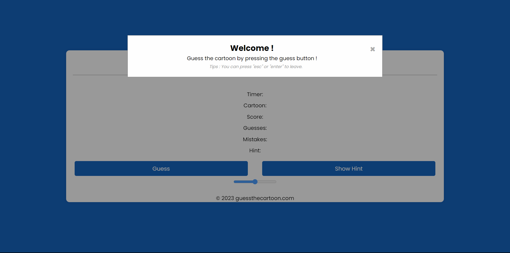
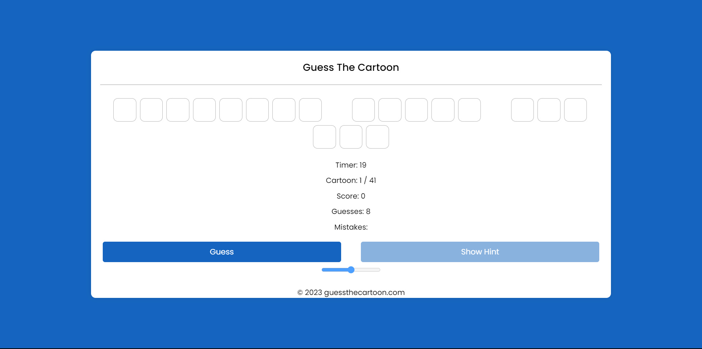
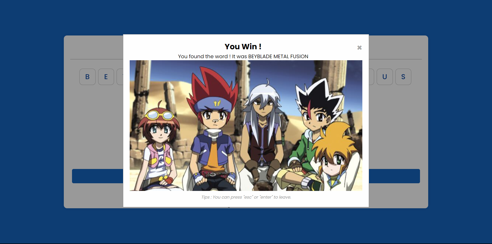
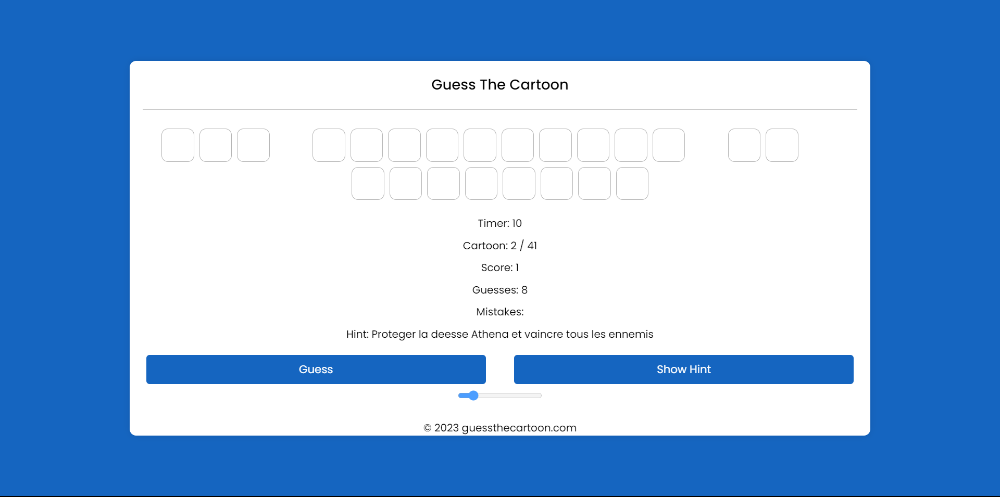

# GuessTheCartoon
## Description
"Guess the Cartoon" is an interactive game that will test your knowledge and memory of classic cartoons. This captivating game is designed for cartoon enthusiasts of all ages, whether young or adult, and offers an entertaining and nostalgic challenge.

The concept of the game is simple: you will be immersed in the world of cartoon theme songs, and your objective will be to guess which cartoon it is. The original theme song of each cartoon will be played, while you input letters on the screen to recall the name of the cartoon.

The cartoons featured in the game span from the 1980s to the 2010s, covering a wide range of beloved animated shows.

Get ready to embark on a journey through the animated world and test your knowledge of classic cartoons in "Guess the Cartoon" !

PS: Please make sure to enable sound in your web browser for the optimal experience !

---

## Screenshots

